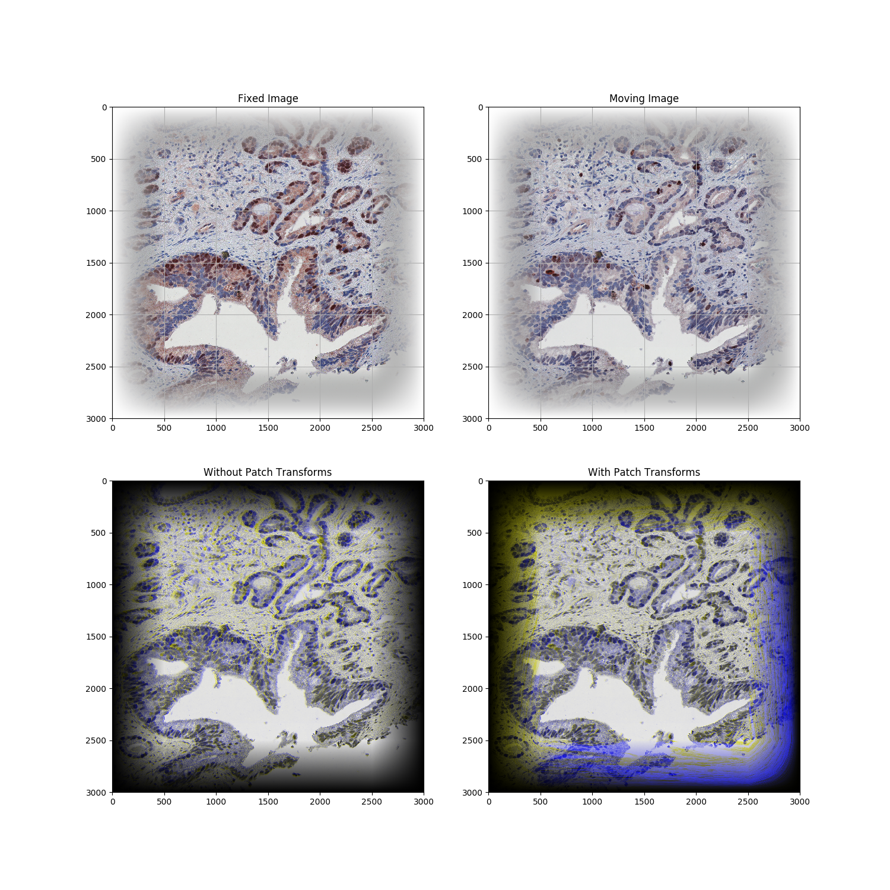
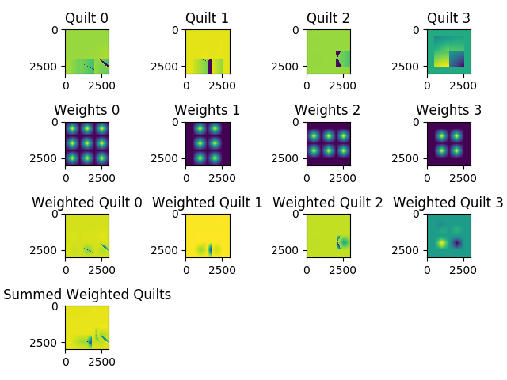

# WSI Registration

Users should checkout the `stable` branch. `master` is the dev branch and contains a lot of 
additional junk from past and future experiments. 

## Description
A novel and powerful approach for image registration of large images. Turns patch registrations 
into a smooth global registration by interpolating between overlapping DVFs.

WSIREG interpolates the values for EVERY POINT, not just between patch centers. You probably don't 
need this approach and should be using a global b-spline deformation instead.

## Usage
WARNING: this package was developed and tested on a server. It is extremely memory intensive, and will crash 
with MemoryError if you're not careful. In testing it never caused anything nasty to happen, but 
keep an eye on it.

`demo.py` contains `bilinear_interpolation_of_patch_registration()` which walks you through the 
process of registering an image.

## Requirements
cv2
numpy
matplotlib
scipy
scikit-image

## Long Explanation

Whole slide images have some unique difficulties when it comes to image registration. The large 
size of the images makes a high quality registration expensive to calculate, 
and a globally optimized registration is likely to be a poor fit for any given spot. 

A common approach is as follows: 

1. a global affine registration, followed by 
2. a b-spline grid registration. A transformation is calculated for each of the vertices of the b-spline grid, 
and the global DVF is calculated by interpolating between these vectors. 

You should try this approach first!

WSIREG takes it one step further. 

1. a global affine registration, followed by
2. a global interpolation of local transformations for each pixel of the image.

#### Purpose
This method is both powerful and flexible. The demo uses bilinear interpolation and affine patch registration,
but it could be applied to any combination of interpolation and patch registration methods, 
including non-linear registrations computed by a neural net to correct severe local deformations.

#### Process
Figure 1: _5x5 patches. Every vertex is the center of a patch covering 4 tiles. 
Registration is significantly improved after per-patch registration._

Figure 2: _Bilinear interpolation of a full DVF set (different region than above to highlight smoothing effect.)_

- A global affine registration is calculated on a downsampled image and applied to the moving image. 

- Next, the fixed and moving images are tiled into patches. Each patch has a 50% overlap with each 
neighboring patch per direction and per dimension, so that each pixel is included in 4 patches. 

- A registration transformation is calculated per-patch between fixed and moving images. This 
registration is applied to an identity deformation field to create the patch's deformation field.

- The patch DVFs are split into 4 disjoint sets of non-overlapping patches. 
Each subset covers the image. 

- The patches in each set are stitched together into quilts.

- A set of weights are applied to each quilt.

- Quilts are summed into a single global DVF.

- DVF is applied to the full image with cv2.remap()
